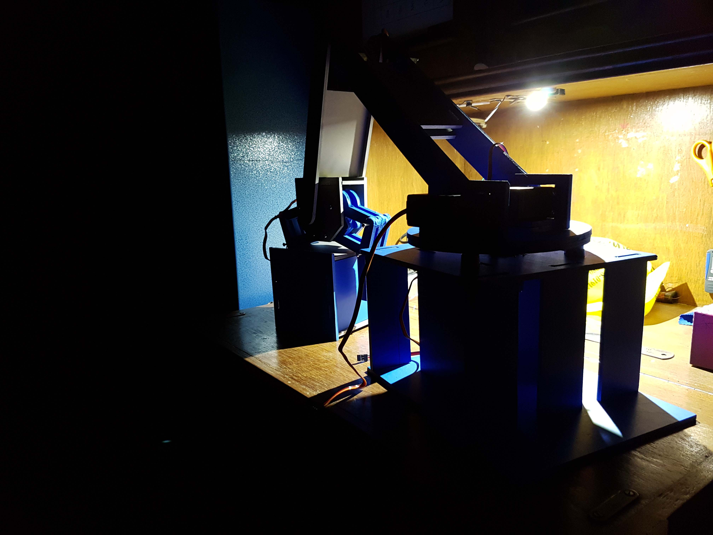
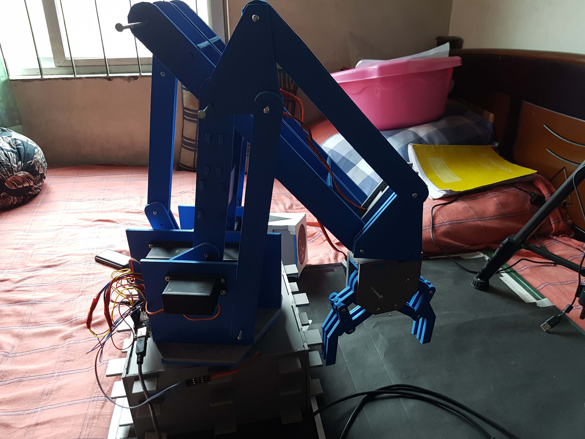

# Industrial-Automation-Challenge-2017
Project and design files for the Industrial Automation Challenge of Robo-Carnival 2017 arranged by BUET Robotics Society

Project Video:

## Contents
- [Challenge Overview](#challenge-overview)
- [Materials Used](#materials-used)
- [Working Principle](#working-principle)
- [Image Gallery](#image-gallery)
- [Team](#team)

## Challenge Overview

Detailed rulebook can be found <a href="IAC 2017 Problem Statement.pdf">here.</a>
### Task:
1. There were 3 types of white cubes having black circle, tringle & square drawn on the top surface. They be moved on a conveyer belt at constant speed.
2. Only one cube passed at a time and cube type was random.
3. We had to build an autonomous robot which could detect the shape drawn on the cube and deposit it in the corresponding zone.

    <figcaption>Arena</figcaption>
</figure>

## Materials Used

| Material |Amount	|Price Per Unit	| Cost(BDT) |
|----------|--------|---------------|-----------|
|PVC Sheet |	2	|   250	        |   500     |
|Servo 28kg|	4	|   2000	    |   8000    |
|Servo grip|	2	|   500	        |   1000    | 
|Servo base|	1	|   1450	    |   1450    |
|Ball castor|	8	|   80	        |   640     |
|Nut-bolts |	40	|   5	        |   200     |
|Wire	   |    5 	|   20	        |   100     |
|Arduino   |	1	|   500	        |   500     |
|Battery   |	1	|   1680	    |   1680    |
|Webcam	   |    1	|   3000	    |   3000    |
|          |        |   Total       |	17070   |

## Working Principle

### Image Processing for Shape Detection in Black and White

### Control System

### Hardware Design

## Image Gallery

    <figcaption>All Nighters</figcaption>
</figure>

    <figcaption>First Design</figcaption>
</figure>

    <figcaption>Running Initial Tests</figcaption>
</figure>

    <figcaption>Beefing up the Arm</figcaption>
</figure>

    <figcaption>Final Design</figcaption>
</figure>

## Team

- Mir Sayeed Mohammad (EEE) - Hardware design & setup, Image processing, Control - (github.com/ClockWorkKid)
- Mir Mahathir Mohammad (CSE) - Image processing, Control - (github.com/mirmahathir1)
- Md. Atiqur Rahman (CSE) - Image processing, Control - (github.com/shiroe41)
- Sakib Chowdhury (EEE) - CAD design - (github.com/sakibchowdhury131)
- Sazid Noor Rabi (Mech) - Hardware setup